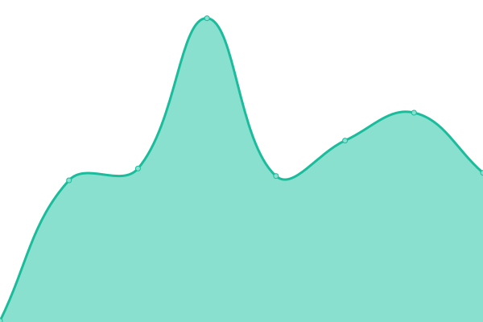
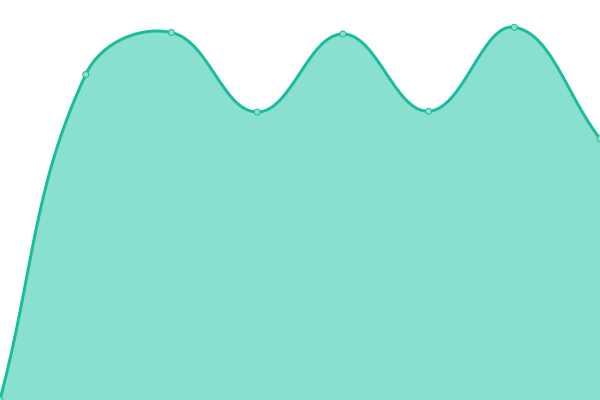

# [📈 Estado en vivo](https://demo.upptime.js.org): <!--live status--> **🟧 Interrupción parcial**

This repository contains the open-source uptime monitor and status page for [Upptime](https://upptime.js.org), powered by [Upptime](https://github.com/upptime/upptime).

With [Upptime](https://upptime.js.org), you can get your own unlimited and free uptime monitor and status page, powered entirely by a GitHub repository. We use [Issues](https://github.com/upptime/upptime/issues) as incident reports, [Actions](https://github.com/terorero/radar/actions) as uptime monitors, and [Pages](https://demo.upptime.js.org) for the status page.

<!--start: status pages-->
<!-- This summary is generated by Upptime (https://github.com/upptime/upptime) -->
<!-- Do not edit this manually, your changes will be overwritten -->
<!-- prettier-ignore -->
| URL | Status | History | Response Time | Uptime |
| --- | ------ | ------- | ------------- | ------ |
|  [La Razón - Intranet](https://intranet.la-razon.com) | 🟥 Down | [la-razon-intranet.yml](https://github.com/terorero/radar/commits/HEAD/history/la-razon-intranet.yml) | 

 102ms
     
 | 

<a href="https://monitor.soporte.eu.org/history/la-razon-intranet">0.00%</a>
    

|  [Transturin SRL.](https://www.transturin.com/web) | 🟥 Down | [transturin-srl.yml](https://github.com/terorero/radar/commits/HEAD/history/transturin-srl.yml) | 

 1496ms
     
 | 

<a href="https://monitor.soporte.eu.org/history/transturin-srl">0.00%</a>
    

|  [Remoto](https://remoto.la-razon.com) | 🟥 Down | [remoto.yml](https://github.com/terorero/radar/commits/HEAD/history/remoto.yml) | 

 94ms
     
 | 

<a href="https://monitor.soporte.eu.org/history/remoto">0.00%</a>
    

|  [Drive24](https://drive.root24.eu.org/login) | 🟥 Down | [drive24.yml](https://github.com/terorero/radar/commits/HEAD/history/drive24.yml) | 

 307ms
     
 | 

<a href="https://monitor.soporte.eu.org/history/drive24">0.00%</a>
    

|  [Kamisaki](https://kamisaki.soporte.eu.org) | 🟩 Up | [kamisaki.yml](https://github.com/terorero/radar/commits/HEAD/history/kamisaki.yml) | 

 935ms
     
 | 

<a href="https://monitor.soporte.eu.org/history/kamisaki">100.00%</a>
    

|  [CONDEVIN Website](https://www.devinconde.com) | 🟩 Up | [condevin-website.yml](https://github.com/terorero/radar/commits/HEAD/history/condevin-website.yml) | 

 452ms
     
 | 

<a href="https://monitor.soporte.eu.org/history/condevin-website">100.00%</a>
    

|  [Bitácora d ROOT](https://www.bitacoraroot.com) | 🟩 Up | [bitacora-d-root.yml](https://github.com/terorero/radar/commits/HEAD/history/bitacora-d-root.yml) | 

 164ms
     
 | 

<a href="https://monitor.soporte.eu.org/history/bitacora-d-root">100.00%</a>
    

|  [Ventas Inmediatas](https://ventasinmediatas.transturin.com) | 🟩 Up | [ventas-inmediatas.yml](https://github.com/terorero/radar/commits/HEAD/history/ventas-inmediatas.yml) | 

 354ms
     
 | 

<a href="https://monitor.soporte.eu.org/history/ventas-inmediatas">100.00%</a>
    

<!--end: status pages-->

[**Visit our status website →**](https://monitor.soporte.eu.org)

## 📄 License

- Powered by: [Upptime](https://github.com/upptime/upptime)
- Code: [MIT](./LICENSE) © [Upptime](https://upptime.js.org)
- Data in the `./history` directory: [Open Database License](https://opendatacommons.org/licenses/odbl/1-0/)
